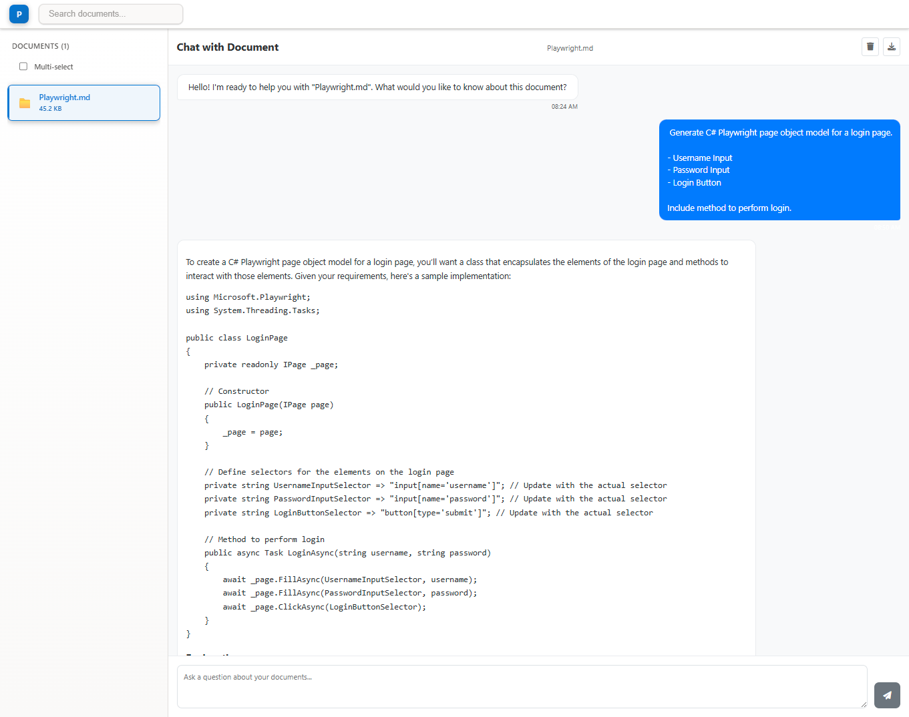

# AIDocumentRAG

A full-stack document management and AI chat application that enables users to upload, manage, and chat with their documents using AI. Built with ASP.NET Core Web API backend and Angular frontend.

## Overview

AIDocumentRAG provides an intelligent document management system with AI-powered chat capabilities. Users can upload documents, organize them in a searchable interface, and engage in natural language conversations about document contents using multiple AI providers including OpenAI's GPT models and Ollama.



## Features

### Document Management

- **File Processing**: Automatic copying and metadata extraction from source directories
- **Multiple Format Support**: PDF, Word documents (.docx, .doc), Excel files (.xlsx, .xls), text files (.txt), and more
- **Metadata Tracking**: File size, creation date, modification date, character count, and file extension
- **Search Functionality**: Real-time search across file names, types, sizes, and dates
- **Multi-Select Mode**: Select and work with multiple documents simultaneously
- **File Upload**: Direct file upload support with drag-and-drop interface
- **File Operations**: Rename, delete, and retrieve file content
- **File Status Tracking**: System initialization and file management status

### AI Chat Interface

- **Multi-Provider Support**: OpenAI GPT models and Ollama local models
- **Document-Aware Conversations**: Chat about specific documents or multiple documents at once
- **Conversation History**: Persistent chat history per document/document set with local storage
- **Streaming Responses**: Real-time AI response streaming for better user experience
- **Context-Aware Prompts**: Automatic document context injection into chat prompts
- **Export Functionality**: Export chat conversations as JSON files
- **Model Selection**: Choose between different AI models and providers

### Document Summarization

- **Single Document Summaries**: Generate summaries for individual documents
- **Multi-Document Summaries**: Batch summary generation for multiple documents
- **Caching System**: Intelligent caching of summaries to improve performance
- **Summary State Management**: Track loading states and summary availability

### Note Generation

- **Single Document Notes**: Generate structured notes for individual documents
- **Multi-Document Notes**: Create cross-document analysis and comparative notes
- **Note Management**: Full CRUD operations for notes (create, read, update, delete)
- **Note Search**: Search across all generated notes
- **Note Categories and Tags**: Organize notes with categories and tagging system
- **Cross-Document Context**: Analyze relationships between multiple documents

### User Interface

- **Fluent Design**: Modern UI following Microsoft Fluent Design principles
- **Responsive Layout**: Grid-based layout that adapts to different screen sizes
- **Real-time Updates**: Live document status and loading indicators
- **Search Integration**: Integrated search with filtering and result highlighting
- **Tabbed Interface**: Separate tabs for chat and note generation
- **Drag and Drop**: Intuitive file upload with visual feedback

## Architecture

### Backend (ASP.NET Core)

- **Controllers**:
  - `FileManagementController`: Handles document operations (initialize, upload, list, retrieve, delete, rename)
  - `AIChatController`: Manages AI chat interactions (regular and streaming) with multi-provider support
  - `DocumentSummaryController`: Generates and retrieves document summaries
  - `NoteGenerationController`: Manages note generation and CRUD operations
- **Services**:
  - `FileManagementService`: Core document processing and repository management
  - `AIChatService`: Multi-provider AI integration with Semantic Kernel
  - `DocumentSummaryService`: Document summarization with caching
  - `NoteGenerationService`: Note generation and management
- **Models**: Comprehensive request/response DTOs with API responses

### Frontend (Angular)

- **Components**:
  - `DocumentsQuickViewComponent`: Sidebar for document browsing and selection
  - `ChatViewComponent`: Main chat interface with conversation management and multi-provider support
  - `NoteGenerationComponent`: Note generation interface with form controls
  - `FileUploadComponent`: File upload with drag-and-drop support
  - `LoadingDialogComponent`: System initialization and loading states
- **Services**:
  - `FileManagementService`: Backend API integration
  - `DocumentSearchService`: Client-side search functionality
  - `AIChatService`: Multi-provider AI chat API integration
  - `DocumentSummaryService`: Summary management with caching
  - `NoteGenerationService`: Note generation and management

## API Endpoints

### File Management

- `GET /api/filemanagement/status` - System status and initialization state
- `POST /api/filemanagement/initialize` - Initialize with source/destination paths
- `POST /api/filemanagement/upload` - Upload individual files
- `GET /api/filemanagement/files` - List all managed files
- `GET /api/filemanagement/files/{fileName}` - Get specific file metadata
- `GET /api/filemanagement/files/{fileName}/content` - Get file content
- `DELETE /api/filemanagement/files/{fileName}` - Delete specific file
- `POST /api/filemanagement/files/{fileName}/rename` - Rename files

### AI Chat

- `GET /api/aichat/ollama/models` - Get available Ollama models
- `POST /api/aichat/chat` - Send chat message (synchronous)
- `POST /api/aichat/chat/stream` - Send chat message (streaming response)

### Document Summarization

- `GET /api/documentsummary/{fileName}` - Get summary for specific document
- `POST /api/documentsummary/multiple` - Get summaries for multiple documents

### Note Generation

- `POST /api/notegeneration/generate` - Generate note for single document
- `POST /api/notegeneration/generate-multi` - Generate multi-document note
- `GET /api/notegeneration/all` - Get all notes
- `GET /api/notegeneration/{noteId}` - Get specific note by ID
- `GET /api/notegeneration/document/{fileName}` - Get notes for specific document
- `GET /api/notegeneration/documents/multiple` - Get notes for multiple documents
- `GET /api/notegeneration/cross-document/{documentNames}` - Get cross-document notes
- `GET /api/notegeneration/search` - Search notes by query
- `PUT /api/notegeneration/{noteId}` - Update existing note
- `DELETE /api/notegeneration/{noteId}` - Delete specific note
- `DELETE /api/notegeneration/document/{fileName}` - Delete all notes for document

## Technology Stack

### Backend

- **Framework**: ASP.NET Core (.NET 9.0)
- **AI Integration**: Microsoft Semantic Kernel with OpenAI and Ollama support
- **Architecture**: Clean architecture with SOLID principles
- **Patterns**: Repository pattern, dependency injection, async/await
- **Markdown Processing**: Markdig for content formatting

### Frontend

- **Framework**: Angular 19 with TypeScript
- **UI Library**: Fluent UI Web Components
- **State Management**: RxJS observables and local storage
- **Styling**: CSS with Fluent Design variables and animations
- **Icons**: FontAwesome for file type icons

### Development Tools

- **API Testing**: HTTP files for endpoint testing
- **Configuration**: Environment-based settings
- **CORS**: Configured for development origins
- **Package Manager**: Yarn for dependency management

## Project Structure

```markdown
AIDocumentRAG/
├── AIDocumentRAG.Server/          # ASP.NET Core Web API
│   ├── Controllers/               # API controllers (4 controllers)
│   ├── Services/                  # Business logic services
│   │   ├── ChatInference/        # AI chat and document summary
│   │   ├── FileManagement/       # File operations and processing
│   │   └── NoteGeneration/       # Note generation and management
│   ├── Models/                    # DTOs and data models
│   └── Program.cs                 # Application entry point
├── aidocumentrag.client/          # Angular frontend
│   ├── src/app/components/        # UI components (6 components)
│   ├── src/app/services/          # Angular services (5 services)
│   └── src/environments/          # Environment configuration
└── Data/                          # Sample documentation files
```

## Configuration

### Backend Configuration

- **OpenAI API Key**: Set via `OPENAI_API_KEY` environment variable
- **Ollama Integration**: Local Ollama server at `http://localhost:11434`
- **File Management**: Configurable through `appsettings.json`
  - Default source/destination paths
  - Maximum file size limits
  - Allowed file extensions
- **CORS**: Development origins configured for ports 58585 and 4200
- **Ports**: HTTPS on 7040, HTTP on 5002

### Frontend Configuration

- **API URL**: Configured in `environment.ts` for HTTPS port 7040
- **Proxy Configuration**: Set up for development API calls
- **Angular Version**: 19.2.0 with modern build tools

## Key Components

### FileManagementService

Handles the core document processing workflow:

- Directory copying and file processing
- Metadata extraction and storage
- File repository management with in-memory storage
- File upload, deletion, and renaming operations

### AIChatService

Manages multi-provider AI interactions:

- OpenAI GPT-4o-mini integration
- Ollama local model support
- Streaming and non-streaming responses
- Error handling and logging

### DocumentSummaryService

Provides intelligent document summarization:

- Single and multi-document summary generation
- Intelligent caching system
- Performance optimization through state management

### NoteGenerationService

Enables comprehensive note management:

- Single and multi-document note generation
- Full CRUD operations for notes
- Cross-document analysis capabilities
- Search and filtering functionality

### Search System

Provides intelligent document discovery:

- Real-time filtering across multiple criteria
- File type keyword matching
- Size and date range queries
- Client-side search optimization

### Chat System

Enables document-focused conversations:

- Single and multi-document chat modes
- Conversation persistence per document set with local storage
- Export functionality for chat history
- Multi-provider AI model support
- Context-aware prompt building

## Missing Features (Not Yet Implemented)

- **User Authentication**: No user management or authentication system
- **Database Persistence**: All data is stored in-memory (lost on restart)
- **File Versioning**: No version control for uploaded documents
- **Collaborative Features**: No multi-user collaboration capabilities
- **Advanced Analytics**: No usage statistics or document analytics
- **WebSocket Support**: No real-time collaboration features
- **File Encryption**: No encryption for sensitive documents
- **Backup/Restore**: No automated backup system for conversations and notes
